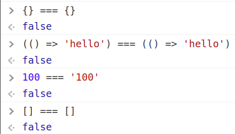

These are just some of the tips I wish I knew when I started learning JavaScript

#### 1. [MDN](https://developer.mozilla.org/en-US/docs/Web/JavaScript ) is your friend

It's very easy to get angry at JavaScript cause it does these things:



Understanding how it works is going to be a lot more helpful than going against it.

#### 2. [Understand reference vs primitive types](https://www.freecodecamp.org/news/primitive-vs-reference-data-types-in-javascript/)

The following is possible in JS

```javascript
{} === {} // false
(() => 'hello') === (() => 'hello') // false
new Date() === new Date() // false
```

In JavaScript, objects are a [reference type](https://javascript.info/reference-type).

Storing an object in a variable like so:

```js
const  myObject = {};
```
Does not follow the same process of storing a [primitive type](https://developer.mozilla.org/en-US/docs/Glossary/Primitive#:~:text=In%20JavaScript%2C%20a%20primitive%20(primitive,has%20no%20methods%20or%20properties.) in a variable as such

```js
const number = 4;
```

In the case of the number, the number value is stored in a box that's grouped in a stack of boxes in memory. Retrieving the value is as easy as retrieving the box.

In the case of the object (any reference type really), only the address or location of the value is stored in the box. The computer has to go to the address and actually retrieve the object's value to get it. Therefore, doing `{} === {}` is really just comparing whether the two addresses stored in memory are the same - and the answer is usually no.

#### 3. Understand how [closures](https://medium.com/@samkwon521/eli5-closures-c0018a23e3c5) work

> "Closure is when a function is able to remember and access its lexical scope even when the function is executing outside its lexical scope.”

```javascript
function outerFunction() {
  let foo = 'foo';

	// has access to the foo variable
  function innerFunction() {
    console.log(foo);
  }

  return innerFunction;
}

// assigned the same address as what's returned from outerFunction()
var basicallyTheInnerFunction = outerFunction();

// remember that the basicallyTheInnerFunction and the function returned from outerFunction() now shares the same address
// this means they're pointing to the same location in memory
// when this executes, it would print out the value of 'foo' even though outerFunction() has already executed and is technically 'done'
// the function still has the same access to its "lexical scope" even though it is executing outside of the outerFunction
secondBar();
```


